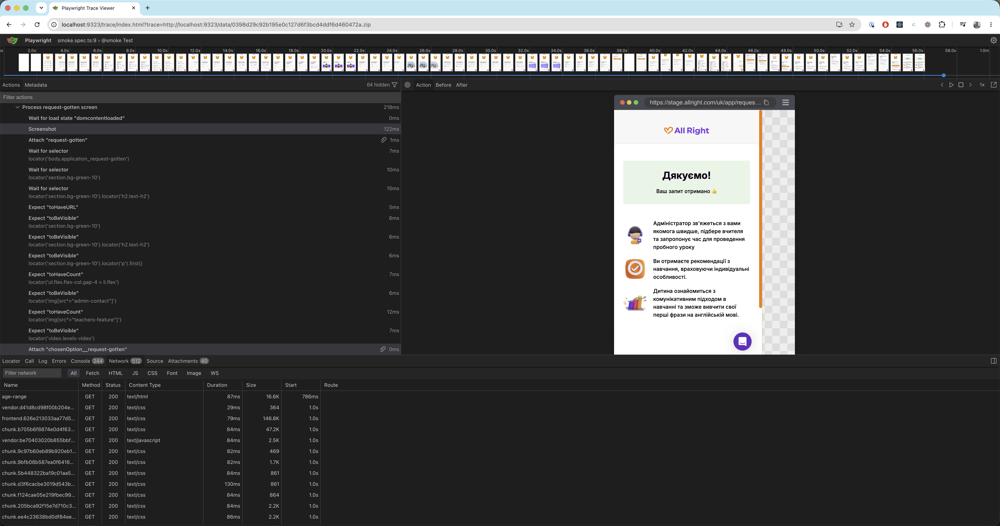
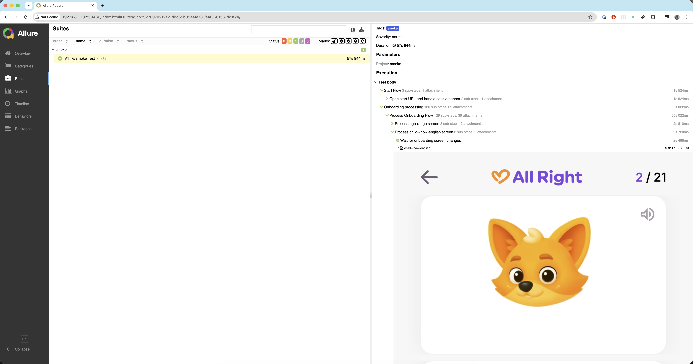
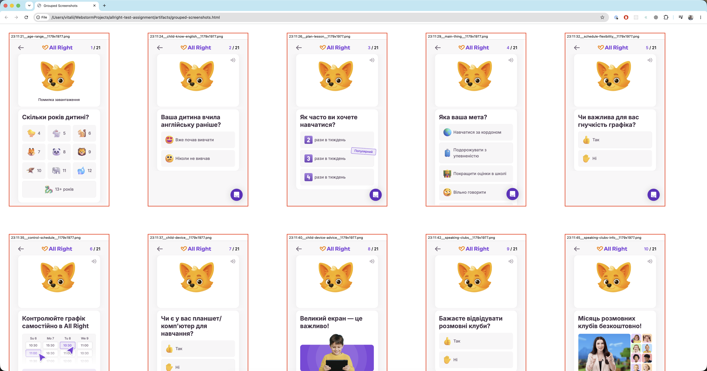

# Test Reports

Reports are available **locally** after a run, and on **CI** are also uploaded to S3 / CloudFront (see [CI Setup](./CI_SETUP.md) and [AWS setup](./AWS_S3_CLOUDFRONT_SETUP.md)).

## Playwright HTML report

Timeline, status, screenshots, and traces.

```bash
npm run pw_report
# or
npx playwright show-report
```

**Location**: `playwright-report/`

Traces (config has `trace: "on"`) also land under `test-results/` and open from the HTML report.



## Allure report

Steps, attachments (chosen options, experiment, screenshots metadata).

```bash
npm run allure_report
```

**Locations**:

- raw: `allure-results/`
- HTML: `allure-report/`



## Screenshots

Captured per onboarding screen during the funnel.

**Location**: `artifacts/screenshots/`

Naming pattern: `<HH-MM-SS>__<screen-name>__<WxH>.png`

### Grouped screenshots

When `GROUP_SCREENSHOTS=true`, screenshots are also collected into a single HTML gallery:

**Location**: `artifacts/grouped-screenshots.html`



## CI / S3 URLs

On GitHub Actions the job prints CloudFront URLs for:

| Report      | S3 folder                      | Entry                      |
| ----------- | ------------------------------ | -------------------------- |
| Allure      | `.../allure/{timestamp}/`      | `index.html`               |
| Playwright  | `.../trace/{timestamp}/`       | `index.html`               |
| Screenshots | `.../screenshots/{timestamp}/` | `grouped-screenshots.html` |

Paths are also written to `artifacts/report-urls.txt`.

## Artifacts layout

```
artifacts/
├── screenshots/
├── grouped-screenshots.html   # when GROUP_SCREENSHOTS=true
├── report-urls.txt            # CI: CloudFront URLs
└── trace_report_s3_bucket.txt # CI: S3 path for Playwright HTML
playwright-report/
allure-results/
allure-report/
test-results/          # traces, failure dumps
```

## Troubleshooting

### Empty Allure report

- Ensure the test run finished and wrote `allure-results/`
- Re-run `npm run allure_report` (uses `--clean`)

### No Playwright report

- Run tests once, then `npm run pw_report`
- Check `playwright-report/` exists

### Missing screenshots

- Confirm `artifacts/screenshots/` after a full smoke pass
- Global setup prepares artifact directories on run start

### CI upload skipped

- Set repo Variables `S3_BUCKET`, `S3_DOMAIN` and Secrets `AWS_ACCESS_KEY_ID`, `AWS_SECRET_ACCESS_KEY`
